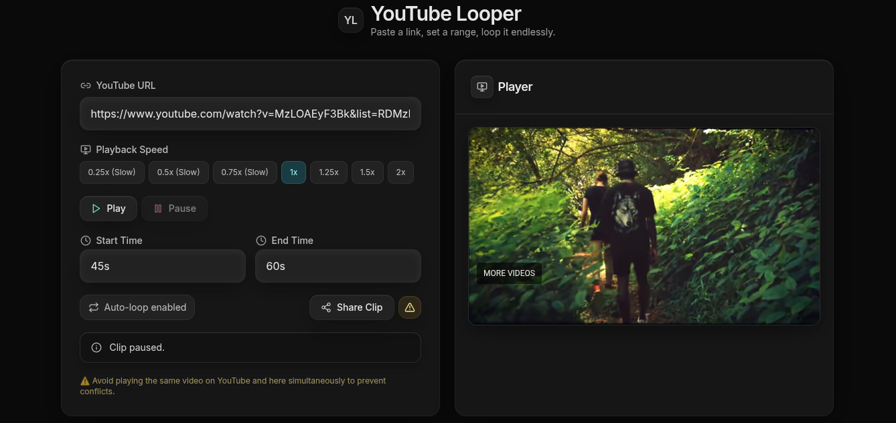

# YouTube Clipper & Looper

Loop your favorite YouTube moments endlessly.

## Features

- **Embed any YouTube video** - Paste any YouTube URL and start clipping
- **Precise time control** - Set exact start and end times in seconds
- **Auto-looping** - Your clip plays on repeat automatically
- **Modern UI** - Clean, responsive design
- **Instant playback** - No downloads, streams directly from YouTube

## How to Use

1. **Paste a YouTube URL** - Any format works:
   - `https://www.youtube.com/watch?v=dQw4w9WgXcQ`
   - `https://youtu.be/dQw4w9WgXcQ`
   - Just the video ID: `dQw4w9WgXcQ`

2. **Click "Load Video"** - The video will appear in the player

3. **Set your clip times**:
   - **Start time** (in seconds): e.g., `30` for 30 seconds in
   - **End time** (in seconds): e.g., `45` for 45 seconds in

4. **Click "Play Clip"** - Your selected section will loop endlessly!

## Perfect For

- Dance practice - Loop choreography sections
- Music learning - Practice guitar solos or drum patterns
- Acting practice - Rehearse specific scenes
- Workout routines - Repeat exercise sequences
- Art tutorials - Master specific techniques
- Gaming highlights - Relive epic moments

## Tech Stack

- **Frontend**: React 18 + Vite
- **Styling**: Tailwind CSS
- **Icons**: Lucide React
- **Player**: YouTube IFrame API

## Browser Support

- ✅ Chrome (recommended)
- ✅ Firefox
- ✅ Safari
- ✅ Edge
- ❌ Internet Explorer (not supported)

## Screenshots

---

**Made with ❤️ for the YouTube community**
